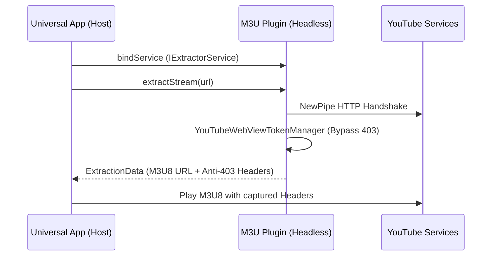

# MASTER_DOCS - IPTV Player Beta (Universal + Plugin)

Esta documentação consolida o conhecimento técnico sobre a arquitetura, o motor de extração e os fluxos de sincronização do projeto.

---

## 1. Arquitetura do Sistema

O projeto é dividido em dois apps distintos que se comunicam via **AIDL (Android Interface Definition Language)**:

1. **Host App (`com.m3u.android`)**: O player principal (Universal), responsável pela UI, gerenciamento de playlists e reprodução de mídia.
2. **Plugin App (`com.m3u.plugin`)**: Uma extensão "headless" (sem UI visível) especializada em resolver URLs complexas (YouTube, Twitch) em links diretos HLS (`.m3u8`).

### Diagrama de Comunicação (IPC)

---

## 2. Motor de Extração YouTube (Anti-403)

Para contornar os bloqueios do YouTube (Erro 403 Forbidden), o ríalo utiliza uma estratégia híbrida:

### A. NewPipe Extractor (Nativo)
Utiliza a biblioteca NewPipe para analisar a página do YouTube e obter o manifesto HLS. É rápido e não depende de WebViews pesadas para a análise de dados.

### B. YouTubeWebViewTokenManager (Bypass)
Quando o YouTube detecta acesso automatizado, ele exige tokens específicos:
- **PO Token (Proof of Origin)**: Garante que a requisição veio de um ambiente confiável.
- **Visitor Data (X-Goog-Visitor-Id)**: Define a sessão do visitante.

O `YouTubeWebViewTokenManager` abre uma WebView oculta para visitar `youtube.com`, captura esses tokens via injeção de JavaScript e os armazena no `IdentityRegistry`.

### C. IdentityRegistry (Sessão Única)
Localizado no módulo `core:foundation`, este registro centraliza e compartilha UA (User-Agent), Cookies e Tokens entre os dois processos.
- **Persistência**: Salvo em `id.txt` e `SharedPreferences`.
- **Aplicação**: Injeta automaticamente os headers necessários no ExoPlayer e no Extrator.

---

## 3. Fluxo de Sincronização Dropbox

A funcionalidade de "Sincronização Manual" segue este fluxo:
1. O Host solicita `syncChannels` via AIDL.
2. O Plugin baixa o arquivo `channels.json` do Dropbox via `DropboxRepository`.
3. O `LinkExtractionWorker` (ou serviço manual) processa cada URL do JSON.
4. O `NewPipeResolver` resolve as URLs YouTube em links `.m3u8`.
5. O resultado é salvo em `resolved_channels_cache.json` e notificado ao Host via **Broadcast**.

---

## 4. Guia de Troubleshooting

### Erro 403 Forbidden
- **Causa**: Tokens expirados ou bloqueio de IP.
- **Solução**: O sistema inicia automaticamente o `YouTubeWebViewTokenManager` ao detectar falha. Se persistir, limpe o cache do app de Extensão.

### Plugins Não Detectado
- **Causa**: O app de extensão não está instalado ou a assinatura não confere.
- **Verificação**: `adb logcat -s ExtractorRepository` para ver logs de bind.

---

## 5. Build e Versões
- **ABIs Suportadas**: `armeabi-v7a`, `arm64-v8a`.
- **Min SDK**: 26 (Android 8.0).
- **Target SDK**: 34 (Android 14).
