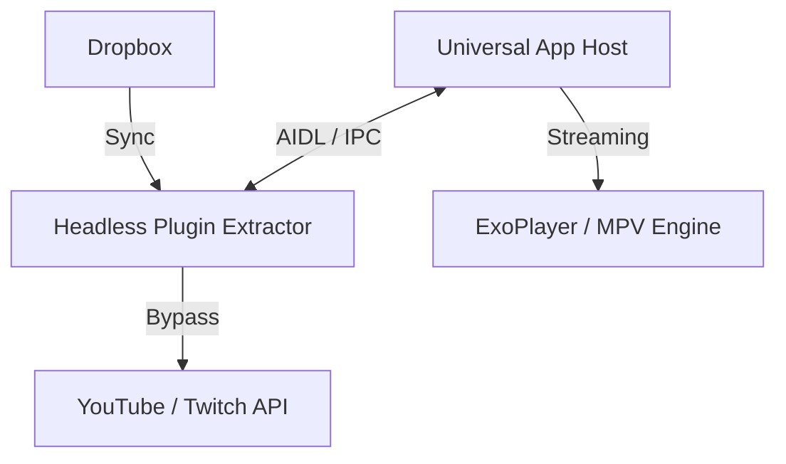

# 📺 IPTV Player Beta (Project Universal)

> **O player IPTV definitivo para Android Mobile e Android TV, com motor nativo de extração YouTube e proteção anti-403.**

---

## ✨ Features Premium

- **🚀 Motor Native Extractor (v6)**: Extração HLS direta via NewPipe Extractor + Headless Plugin.
- **🛡️ Protocolo Anti-403**: Sistema inteligente de bypass (PO Token + Visitor Data) integrado.
- **☁️ Dropbox Sync**: Sincronização automática de playlists dinâmicas via Dropbox.
- **📺 Interface Adaptável**: UX premium para TV (Material3 TV) e Mobile com suporte a controle remoto.
- **⚙️ Multi-Engine Playback**: Suporte a ExoPlayer, MPV e VLC em uma única interface.

---

## 🛠️ Arquitetura do Ecossistema

O projeto utiliza uma arquitetura de microserviços mobile, permitindo que a extração pesada ocorra em um processo isolado.

---

## 📥 Instalação Rápida

Para o funcionamento completo (incluindo YouTube), você pode gerar os pacotes finais rodando o script `build-final.bat`.
Os APKs gerados estarão localizados nas respectivas pastas de `build/` (Universal e Plugin):

1. **Host App**: `app-universal-release.apk`
2. **Extractor Plugin**: `app-m3u-plugin-release.apk`

> [!IMPORTANT]
> O Extrator funciona como um serviço headless. Após a instalação, ele não aparecerá no menu de apps, mas será ativado automaticamente pelo app principal.

---

## 📘 Documentação Técnica

Para detalhes profundos sobre a implementação, ríalos de segurança e fluxos de dados, consulte nosso arquivo mestre:

👉 **[Consulte o MASTER_DOCS.md](./MASTER_DOCS.md)**

---

## 🤝 Contribuição e Licença

Este projeto é desenvolvido com foco em performance e privacidade. Sinta-se à vontade para abrir Issues ou Pull Requests.

- **Designer/Lead**: Team Antigravity
- **Engine**: NewPipe / ExoPlayer
- **Licença**: MIT